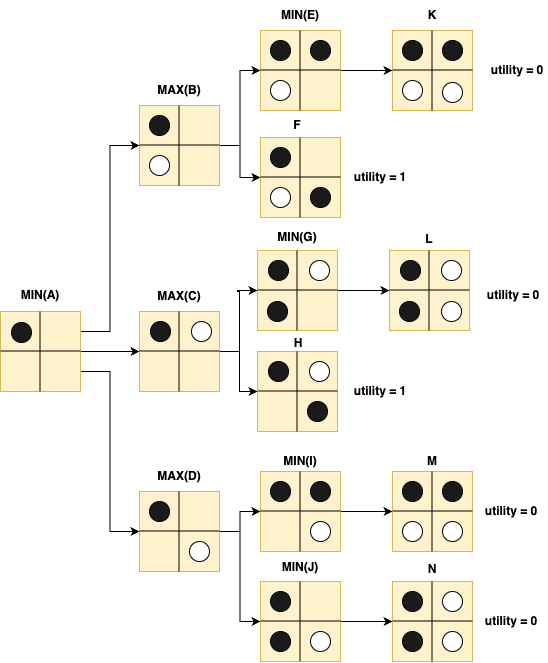

# Alpha Omuk (오목)
Basic RL (reinforcement learning) algorithms for a deterministic, zero-sum board game including a simplified version of AlphaGo. <br><br>
Gomoku, also known as "Omuk" in Korea, is an extension to tic-tac-toe. Instead of three-in-a-row you need five to win the game. Moreover, you play on a much larger board usually of size 15x15.
When combining the algorithms in this project with an efficient evaluation function, simple game-playing algorithms such as minimax can produce decent results. However, I wanted to create an "undefeatable" AI agent without relying on any
expert/domain knowledge (heuristic function). Therefore, all algorithms (exclduing DQN) use a very simple evaluation function.

## Installation
Pygame is required to run this application in GUI mode. However, if you're having trouble with installing Pygame, you can also run this project through the command prompt (terminal).
Regardless, the requirements.txt file will install all dependencies needed to run, modify, and test this project.
```bash
# python 3.9
pip install -r requirements.txt
```
There are several agruments you can pass to change the characteristics of the program:
* cli: disables the gui (pygame) and runs the game inside the terminal
* user: decides who players first, O or X
* agent: choose which algorithm the AI runs 
* rows: sets the number of rows on the board
* cols: sets the numeber of columns on the board
* cnt: the number of tokens you win in-a-row to win the game
```bash
# example 
cd AlphaOmuk/
python main.py --cli --user="X" --agent=minimax --rows=10 --cols=12 --cnt=4
```

## Minimax (with alpha-beta pruning)
Given a zero-sum game, where the state space is finite, and both players are playing optimally, minimax may be an appropriate algorithm. It's called “minimax” due to the recursive nature of both players trying to maximize and minimize their respective utility (score). 
For example, in this contrived example, a player scores one point for diagonal tokens (board pieces) placed in a row. The black token aims to maximize the utility, while the white token aims to minimize the same utility.

<p align="center">
  
</p>

Assume the first move is made by the black token and places its token on the top left-hand corner of the board as shown in state A. 
Now it is the white token's turn to make a move, and it has three choices: B, C, and D. Since the white token aims to minimize the utility, the state (move) that white chooses will be determined by:

$$\pi(S_{A}) = argmin_{CS \in  \{S_{B}, S_{C}, S_{D}\}} \left[ argmax \left(utility(CS)\right) \right]$$

For a game like Gomoku, where the board size is 15x15, minimax will take far too long. Modifications to the minimax algorithm can be made to eliminate unnecessary searches such as alpha-beta pruning. 
Alpha represents the smallest utility value found, while beta represents the largest utility value. In the example above, if white beings by evaluating state D, then the utility at state D will be min(0,0) = 0. State C has two child nodes, and if H is evaluated first, then we can prune state G. 
This is because we know for a fact that state A is a min node, and therefore whatever utility is returned, white will never choose any state with a utility higher than 0 (state D). As a result, States G and E will be pruned if white evaluates the states in a bottom-up manner.

To further optimizem minimax, we can cache (store) the game tree since in a determininstic, non-stochastic environment, the state values will not change. Moreover, we can employ an iterative deepening approach to prevent minimax from recursing too deep into the game tree.
The search space is also limited based on the last move played. For example, if the last move placed is (3,4), minimax will only evaluate $\sum\limits_{i=1}^{5}\sum\limits_{j=2}^{6} minimax(S_{i,j})$. However, Despite all these efforts, without a heuristic, minimax 
fails to play optimially in time. In fact, when the action space is greater than 9, the amount of time it takes for minimax to find a solution is unacceptable.

## Monte-Carlo Tree Simulation


## $V^{\pi}(s)$ Policy Iteration

## SARSA

## DQN (Deep Q-Network)

